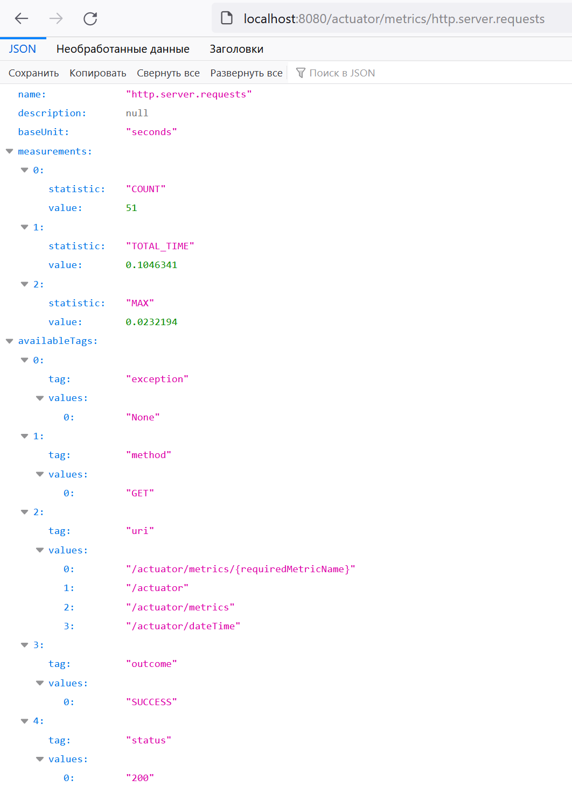

# java_skbCourse_hw11
## Обслуживание
## Демонстрация работы
### Количество запросов,  и время их выполнения
`http://127.0.0.1:8080/actuator/metrics/http.server.requests`

### Кастомный актуатор
`http://localhost:8080/actuator/dateTime`

### Кастомная метрика
`http://localhost:8080/actuator/metrics/custom.counter.time`

P.S Значение увеличивается каждые 5 секунд.
## Запуск
1. Выполните команду: `mvn spring-boot:run`

